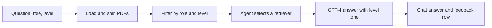
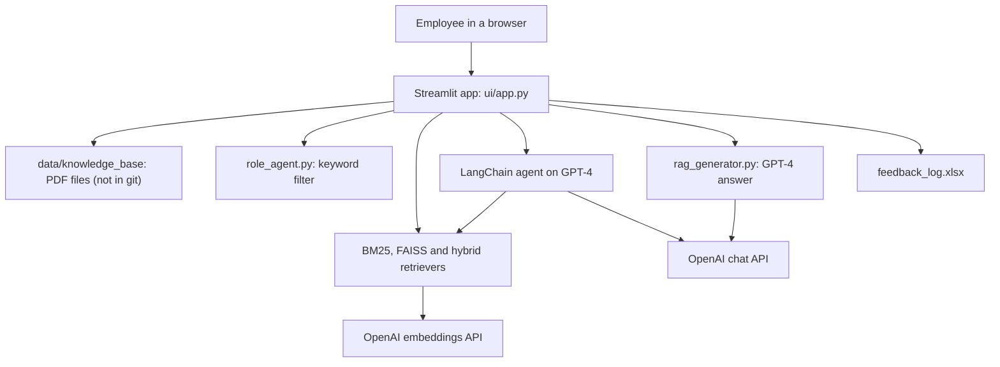
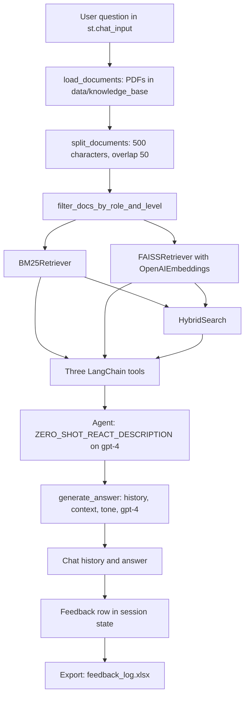

<div align="center">

# KnowFlow-RAG — Role-Aware Onboarding Chatbot with Hybrid Search and Agentic RAG

**KnowFlow is a Streamlit chatbot that answers onboarding questions for data roles. It takes a question, a role and a level through these steps to a GPT-4 answer in the tone of that level:**

`load PDFs` → `split into chunks` → `filter by role and level` → `BM25 + FAISS + hybrid retrievers` → `agent selects a retriever` → `GPT-4 answer` → `feedback log`.


-F5C542?style=for-the-badge)


**[Summary](#1-summary)** ·
**[Workflow](#4-the-end-to-end-workflow)** ·
**[Documents](#11-the-documented-design-and-the-code)** ·
**[Run it](#13-how-to-run-knowflow)** ·
**[Configuration](#134-environment-variables)** ·
**[Known problems](#16-known-problems)** ·
**[Glossary](#18-glossary)**

</div>

> [!NOTE]
> This README uses ASD-STE100 Simplified Technical English. The writing rules and the project
> vocabulary are in [`docs/ste-style-guide.md`](docs/ste-style-guide.md). Each term in the
> [Glossary](#18-glossary) has only one meaning.

> [!WARNING]
> Do not commit your OpenAI API key. KnowFlow reads the key from `KnowFlow/.env`, and git ignores that file.
> Each question makes several paid OpenAI calls, because the app builds the embeddings again for each question.

---

KnowFlow is a university group project about knowledge transfer for new employees in data roles.
The user selects a role (Data Scientist, Data Engineer or Data Analyst) and a level (Junior, Mid or Senior).
The app keeps only the document chunks that contain the keywords of that role and level.
A LangChain agent selects a BM25, a FAISS or a hybrid retriever, and GPT-4 writes the answer in the tone of the level.
The user marks each answer as helpful or not, and the app exports this feedback to Excel.

This repository holds two parts. The **documents** are the installation guide, the project report and the presentation.
The **source code** is the Streamlit prototype in [`KnowFlow/`](KnowFlow/). The repository does not hold the knowledge base PDFs.

This README is the **one location that explains all of KnowFlow-RAG**. It gives these topics:

- the general design
- each component and its procedure, step by step
- the differences between the report and the code
- the data map
- the runbook
- the validation results and the known problems

| If you are… | Read |
|---|---|
| A manager or reviewer | [1](#1-summary), [3](#3-design-rules), [4](#4-the-end-to-end-workflow), [11](#11-the-documented-design-and-the-code), [15](#15-validation-results), [17](#17-key-points) |
| A developer who joins the project | All sections, in sequence. Keep [13](#13-how-to-run-knowflow) and [16](#16-known-problems) open while you work |
| An operator who runs KnowFlow | [13](#13-how-to-run-knowflow), then [10](#10-the-streamlit-ui-and-the-feedback-log) |

---

## Table of contents

1. 🧭 [Summary](#1-summary)
2. 🏗️ [How KnowFlow is built](#2-how-knowflow-is-built)
   - 2.1 [Components](#21-components)
   - 2.2 [System context](#22-system-context)
   - 2.3 [Repository layout](#23-repository-layout)
   - 2.4 [The documents in the repository](#24-the-documents-in-the-repository)
3. 🛡️ [Design rules](#3-design-rules)
4. 🔄 [The end-to-end workflow](#4-the-end-to-end-workflow)
   - 4.1 [Full flow](#41-full-flow)
   - 4.2 [The life cycle of one question](#42-the-life-cycle-of-one-question)
5. 📄 [Document load and chunk split](#5-document-load-and-chunk-split)
6. 🎯 [The role and level filter](#6-the-role-and-level-filter)
7. 🔍 [The retrievers](#7-the-retrievers)
8. 🤖 [The retriever agent](#8-the-retriever-agent)
9. ✍️ [Answer generation and tone](#9-answer-generation-and-tone)
10. 💬 [The Streamlit UI and the feedback log](#10-the-streamlit-ui-and-the-feedback-log)
11. 📚 [The documented design and the code](#11-the-documented-design-and-the-code)
12. 🗂️ [Data and file map](#12-data-and-file-map)
13. ▶️ [How to run KnowFlow](#13-how-to-run-knowflow)
    - 13.1 [Prerequisites](#131-prerequisites) · 13.2 [Installation](#132-installation) · 13.3 [Run KnowFlow](#133-run-knowflow) · 13.4 [Environment variables](#134-environment-variables)
14. 🧩 [How to extend KnowFlow](#14-how-to-extend-knowflow)
15. ✅ [Validation results](#15-validation-results)
16. ⚠️ [Known problems](#16-known-problems)
17. 📌 [Key points](#17-key-points)
18. 📖 [Glossary](#18-glossary)

---

## 1. Summary

**The problem.** New employees in data roles need answers from internal documents. A generic chatbot gives the same answer to each person. These questions are difficult:

- How do you show a junior analyst and a senior engineer different content from the same document set?
- How do you find documents that match exact tool names and documents that match the meaning of a question?
- How do you select the better search method for each question?
- How do you change the depth of the answer for the experience of the user?
- How do you know if an answer helped the user?

KnowFlow gives each of these questions its own component.

| Item | Value |
|---|---|
| Input | A question in the chat box, a role and a level from the sidebar, and PDF files in `data/knowledge_base` |
| Output | A GPT-4 answer in the chat, and a feedback row (question, answer, Yes or No, comment, role, level) |
| Roles | Data Scientist, Data Engineer, Data Analyst |
| Levels | Junior, Mid, Senior |
| Retrievers | BM25 (keyword), FAISS (semantic, OpenAI embeddings) and hybrid (both) |
| Generation | OpenAI `gpt-4`, `temperature=0.3`, with a tone instruction for each level |
| User interface | Streamlit app `KnowFlow/ui/app.py` at `http://localhost:8501` |
| Code size | 9 Python files. `main.py` is empty. The other 8 files have 383 lines |
| Tests | None |
| Origin | A group project of the Department of Information Science, University of North Texas. The report lists five student authors and one faculty advisor |
| Documents | Installation guide (2 pages), project report (6 pages), presentation (13 slides, only in git history) |



---

## 2. How KnowFlow is built

### 2.1 Components

| Component | Module | Purpose |
|---|---|---|
| Document loader and splitter | `KnowFlow/utils/preprocess.py` | `load_documents` reads each PDF with `PyPDFLoader`. `split_documents` makes chunks of 500 characters with 50 characters of overlap |
| Role and level filter | `KnowFlow/agents/role_agent.py` | `role_level_keywords` holds the keywords for 3 roles × 3 levels. `filter_docs_by_role_and_level` keeps the chunks that contain one keyword |
| BM25 retriever | `KnowFlow/retrieval/bm25.py` | `BM25Retriever` with `BM25Okapi` on whitespace tokens. `search` gives the top 3 chunks |
| FAISS retriever (module) | `KnowFlow/retrieval/faiss_vector.py` | `FAISSRetriever` with `HuggingFaceEmbeddings`. The app does not use this class (see [7](#7-the-retrievers)) |
| FAISS retriever (app) | `KnowFlow/ui/app.py` | A second `FAISSRetriever` class with `OpenAIEmbeddings`. The app uses this class |
| Hybrid retriever | `KnowFlow/retrieval/hybrid_search.py` | `HybridSearch` joins the BM25 and FAISS results, removes duplicates and gives the first 3 |
| Retriever agent | `KnowFlow/ui/app.py` | A LangChain `ZERO_SHOT_REACT_DESCRIPTION` agent on `gpt-4` with the three retrievers as tools |
| Answer generator | `KnowFlow/generation/rag_generator.py` | `generate_answer` builds the prompt with history, context and tone, and calls `gpt-4`. `rank_documents` reranks with `all-MiniLM-L6-v2` |
| Streamlit UI | `KnowFlow/ui/app.py` | Sidebar, chat box, chat history, feedback controls and Excel export |
| Entry point | `KnowFlow/main.py` | Empty file (0 bytes) |
| Dependencies | `KnowFlow/requirements.txt` | 136 pinned packages, encoded as UTF-16 |

### 2.2 System context



### 2.3 Repository layout

```
KnowFlow-RAG/
├── .gitignore                                      # env/, KnowFlow/data/, KnowFlow/.env, key files, logs
├── KnowFlow Chatbot Documentation and Installation Guides.pdf   # 2-page installation guide
├── PROJECT_REPORT.pdf                              # 6-page project report
├── POWERPOINT PRESENTATION.pptx                    # 2-byte file with no slides (see section 2.4)
├── docs/ste-style-guide.md                         # writing rules and project vocabulary
└── KnowFlow/
    ├── main.py                                     # empty
    ├── requirements.txt                            # 136 pinned packages (UTF-16)
    ├── feedback_log.xlsx                           # an earlier feedback export, 24 rows
    ├── agents/role_agent.py                        # role and level keywords, filter
    ├── generation/rag_generator.py                 # rerank, prompt, GPT-4 call
    ├── retrieval/
    │   ├── bm25.py                                 # BM25Retriever
    │   ├── faiss_vector.py                         # FAISSRetriever (HuggingFace, not used by the app)
    │   └── hybrid_search.py                        # HybridSearch
    ├── ui/app.py                                   # Streamlit app and agent
    └── utils/preprocess.py                         # PDF load and chunk split
```

### 2.4 The documents in the repository

| File | Contents |
|---|---|
| `KnowFlow Chatbot Documentation and Installation Guides.pdf` | Prerequisites, four installation steps, the run command, the key features and four ideas for improvement |
| `PROJECT_REPORT.pdf` | The paper "KnowFlow: AI-Driven Knowledge Transfer Chatbot for Employee Training Using Agentic RAG": problem, literature review, objectives, data, architecture, implementation, evaluation, conclusion, future scope, references |
| `POWERPOINT PRESENTATION.pptx` | At `HEAD`, this file has 2 bytes (one line break) and no slides |
| `POWERPOINT PRESENTATION GROUP 3.pptx` (git history only) | The 13-slide deck, in commit `6fff8c4`. Commit `579a7ba` replaced it with the 2-byte file |

The deck has these slides: title, agenda, introduction, literature review, proposed methodology, workflow architecture, data collection and preprocessing, model building, model evaluation, results for the Data Analyst role, conclusion, references and a closing slide. To get the deck, run this command in the repository root:

```bash
git show "6fff8c4:POWERPOINT PRESENTATION GROUP 3.pptx" > "POWERPOINT PRESENTATION GROUP 3.pptx"
```

---

## 3. Design rules

### 3.1 The role and the level control the content
The app filters the chunks with the keywords of the selected role and level before any search. A chunk with no keyword of that role and level does not go to a retriever.

### 3.2 Two search methods are available
BM25 finds exact words such as tool names. FAISS finds chunks with a similar meaning. The hybrid retriever gives the results of both methods.

### 3.3 An agent selects the search method
The app does not use one fixed retriever. A LangChain agent reads the tool descriptions and selects the BM25, FAISS or hybrid tool for each question.

### 3.4 The level controls the tone
Each level has its own tone instruction in the prompt. Junior answers use simple language. Senior answers use professional terms and more depth.

### 3.5 The user rates each answer
Each answer has a Yes or No control and a comment box. The sidebar button exports the feedback rows to Excel.

### 3.6 The key stays out of the code
The code reads `OPENAI_API_KEY` from the environment or from a `.env` file. Git ignores `KnowFlow/.env` and the two key text files that `.gitignore` names.

---

## 4. The end-to-end workflow

### 4.1 Full flow



### 4.2 The life cycle of one question

1. The user selects a role and a level in the sidebar. The defaults are `Data Analyst` and `Mid`.
2. The user types a question in the chat box.
3. The app adds the question to `st.session_state.chat_history`.
4. The app loads all PDF files in `data/knowledge_base` and splits them into chunks.
5. The filter keeps the chunks that contain a keyword of the role and level.
6. The app builds a BM25 index and a FAISS index on the kept chunks.
7. The agent calls one or more retriever tools and gives a result.
8. `generate_answer` sends the history, the agent result, the tone and the question to `gpt-4`.
9. The app shows the answer and a feedback control under it.
10. The app adds one feedback row for the answer to `st.session_state.feedback_log`.

---

## 5. Document load and chunk split

**Purpose.** Change the PDF files of the knowledge base into small text chunks.

| Input | Output |
|---|---|
| A folder path, `data/knowledge_base` in the app | A list of LangChain `Document` chunks |

**Procedure**

1. List the files in the folder with `os.listdir`.
2. For each file that ends with `.pdf`, load the pages with `PyPDFLoader`.
3. Split the pages with `RecursiveCharacterTextSplitter(chunk_size=500, chunk_overlap=50)`.

**Rules**

- The loader reads only the top folder. It does not read subfolders.
- The app loads and splits the files again for each question.
- The overlap of 50 characters keeps some context between two chunks.

---

## 6. The role and level filter

**Purpose.** Keep only the chunks that are relevant to the role and the level of the user.

| Input | Output |
|---|---|
| The chunks, the role, the level | The chunks that contain at least one keyword of that role and level |

**Keywords**

| Role | Junior | Mid | Senior |
|---|---|---|---|
| Data Scientist | basics, intro, python, pandas, EDA, linear regression | feature engineering, cross-validation, metrics, XGBoost | model deployment, MLOps, architecture, scaling, optimization |
| Data Engineer | SQL, ETL basics, data pipeline, batch job | Airflow, Spark, data lakes, streaming | architecture, data mesh, BigQuery optimization, DevOps |
| Data Analyst | excel, charts, basic SQL, Power BI | advanced SQL, dashboard, KPIs, insights | strategy, business modeling, forecasting, stakeholder |

**Procedure**

1. Get the keyword list for the role and the level. If the pair is not known, the list is empty.
2. Change each keyword and the chunk text to lower case.
3. Keep the chunk if one keyword is a substring of the chunk text.

**Rules**

- The match is a substring match. For example, `eda` also matches a word that contains these letters.
- A level gets only its own keywords. A Senior user does not get the Junior keywords.

---

## 7. The retrievers

**Purpose.** Find the chunks that answer the question.

| Retriever | Class | Method | Result |
|---|---|---|---|
| BM25 | `BM25Retriever` (`retrieval/bm25.py`) | `BM25Okapi` scores on whitespace tokens. No lower-case change | Top 3 chunks |
| FAISS | `FAISSRetriever` (inline in `ui/app.py`) | `FAISS.from_documents` with `OpenAIEmbeddings`, then `similarity_search` | Top 3 chunks |
| Hybrid | `HybridSearch` (`retrieval/hybrid_search.py`) | BM25 results, then FAISS results, with duplicate text removed | First 3 chunks of the joined list |

**Procedure of the hybrid retriever**

1. Run the BM25 search and get 3 chunks.
2. Run the FAISS search and get 3 chunks.
3. Put the BM25 chunks first and the FAISS chunks after them.
4. Remove a chunk if its text is the same as the text of an earlier chunk.
5. Give the first 3 chunks.

**Rules**

- The app defines its own `FAISSRetriever` class with OpenAI embeddings. This class replaces the imported class from `retrieval/faiss_vector.py`, which uses `HuggingFaceEmbeddings`.
- If BM25 gives 3 different chunks, the hybrid result is the same as the BM25 result (see [16](#16-known-problems)).
- Both indexes stay in memory. The app builds them again for each question.

---

## 8. The retriever agent

**Purpose.** Select the search method for each question.

| Tool name | Function | Description given to the agent |
|---|---|---|
| `BM25 Retriever` | `tool_bm25_func` | `Keyword-based search.` |
| `FAISS Retriever` | `tool_faiss_func` | `Semantic embedding search.` |
| `Hybrid Retriever` | `tool_hybrid_func` | `Combination of keyword and semantic.` |

**Procedure**

1. Make one LangChain `Tool` for each retriever. Each tool joins the text of its chunks with line breaks.
2. Make `ChatOpenAI(model="gpt-4", temperature=0.3)`.
3. Start the agent with `initialize_agent` and `AgentType.ZERO_SHOT_REACT_DESCRIPTION`.
4. Call `agent.invoke(query)`. The agent selects tools, reads their output and writes a result.

**Rules**

- The agent gets only the question. It does not get the role, the level or the chat history.
- `agent.invoke` gives a dictionary with the input and the output of the agent. The app sends this dictionary to the generator as the context.

---

## 9. Answer generation and tone

**Purpose.** Write the final answer in the tone of the level of the user.

| Input | Output |
|---|---|
| The question, the earlier chat turns, the role, the level, the agent result | The answer text |

**Tone instructions**

| Level | Instruction in the prompt |
|---|---|
| Junior | `Use simple language and provide a beginner-friendly explanation.` |
| Mid | `Give a clear and detailed explanation with moderate technical depth.` |
| Senior (and any other value) | `Provide an advanced, in-depth explanation with professional terminology and insights.` |

**Procedure**

1. If no context is given, rerank the chunks with `rank_documents` and keep the top 5.
2. Join the earlier turns as `User:` and `Bot:` lines.
3. Build the prompt: history, `Context:`, the tone instruction, `This answer is for a <level> <role>.`, the question and `Bot:`.
4. Send the prompt as one user message to `gpt-4` with `temperature=0.3`.
5. Give the answer text without leading and trailing spaces.

**Rules**

- `rank_documents` uses `SentenceTransformer("all-MiniLM-L6-v2")` and cosine similarity. It prints the top 5 scores to the console.
- The app always gives the agent result as the context. Thus the app does not call `rank_documents`.

---

## 10. The Streamlit UI and the feedback log

**Purpose.** Let the user ask questions, read answers and rate them.

| UI element | Location | Function |
|---|---|---|
| `Select Role` | Sidebar | Data Scientist, Data Engineer or Data Analyst (default) |
| `Experience Level` | Sidebar | Junior, Mid (default) or Senior |
| `📥 Export Feedback to Excel` | Sidebar | Writes `feedback_log.xlsx` in the current folder |
| Chat box | Bottom | `Ask something about your tools, data, or training...` |
| Chat bubbles | Main area | `You:` and `KnowFlow:` blocks for each turn |
| `Was this helpful? (Qn)` | Under each answer | Yes (default) or No |
| `Additional comments for Qn:` | Under each answer | Free text |

**Procedure of the feedback log**

1. Show each answer with the Yes or No control and the comment box.
2. If the log has no row for the answer, add a row: question, answer, feedback, comment, role, level.
3. When the user clicks the export button, write the log to `feedback_log.xlsx` with pandas.

**Rules**

- The log is in `st.session_state`. A new browser session starts with an empty log.
- The app adds the row on the first display of the answer. Later changes to the control or the comment do not change the row (see [16](#16-known-problems)).

---

## 11. The documented design and the code

The report and the deck describe a larger design than the code. Use this table to know which parts exist in the code.

| Topic | Report or deck | Code in `KnowFlow/` |
|---|---|---|
| User login | A mock login stores the role and level in PostgreSQL | No login. The user selects the role and level in the sidebar |
| Metadata store | PostgreSQL holds tags, tools, checklist items and role bindings | No database |
| BM25 source | BM25 runs on structured SQL data | BM25 runs in memory on the PDF chunks |
| Vector store | Three FAISS stores, one for each role | One FAISS index in memory, built again for each question |
| Embeddings | SentenceTransformer models | `OpenAIEmbeddings` for FAISS. `all-MiniLM-L6-v2` only in the unused `rank_documents` path |
| Document folders | `Data_Scientist`, `Data_Analyst`, `Data_Engineer`, each with `Junior`, `Mid`, `Senior`, each with `Onboarding` and `Projects` | One flat folder, `data/knowledge_base`. The loader does not read subfolders |
| Role filter | `role_agent.py` filters the results after the search | `role_agent.py` filters the chunks before the search |
| Retriever selection | A LangChain agent selects the retriever (deck) | Yes, as in the deck |
| Tone by level | Junior simple, Mid moderate, Senior advanced | Yes |
| Feedback to Excel | Yes or No feedback with role and level, export to Excel (deck) | Yes |
| Knowledge base | Data Analyst roadmaps, Power BI, SQL, Excel, ETL and Hive tutorials (deck), and 10 onboarding and 10 project documents for each role and level (report) | Not in the repository. Git ignores `KnowFlow/data/` |

**Objectives in the report**

1. Combine BM25 lexical search with FAISS semantic search.
2. Use a structured SQL knowledge base and an unstructured vector store.
3. Filter the retrieval by job title.
4. Write the answers with a GPT-4 RAG framework.
5. Change the tone for the junior, mid and senior levels.
6. Measure the effect on onboarding speed and the need for human trainers.
7. Collect user feedback to improve later answers.

The installation guide lists four ideas for improvement: LangGraph agent support, voice input, a persistent vector store and a connection to live HR or document APIs. The report adds more roles, more languages, an admin dashboard, enterprise login, fine-tuned models and automatic scores.

---

## 12. Data and file map

| Path | Committed? | Contents |
|---|---|---|
| `KnowFlow/data/knowledge_base/*.pdf` | No (git ignores `KnowFlow/data/`) | The knowledge base PDFs that the app loads |
| `KnowFlow/.env` | No (git ignores it) | `OPENAI_API_KEY` |
| `KnowFlow/Gpt key.txt`, `KnowFlow/Gpt key-Nandha.txt` | No (git ignores them, and no commit holds them) | Local key files of the team |
| `KnowFlow/feedback_log.xlsx` | Yes | An earlier export: 24 rows, columns `question`, `answer`, `feedback`, `cooment` |
| `feedback_log.xlsx` in the folder where Streamlit runs | No | A new export from the sidebar button. Each export replaces the file |
| `env/` | No (git ignores it) | The virtual environment of the installation guide |
| `KnowFlow Chatbot Documentation and Installation Guides.pdf` | Yes | Installation guide |
| `PROJECT_REPORT.pdf` | Yes | Project report |
| `POWERPOINT PRESENTATION.pptx` | Yes | 2-byte file with no slides. The real deck is in commit `6fff8c4` |

---

## 13. How to run KnowFlow

The installation guide gives the steps in 13.1 to 13.3. The notes marked **From the code** are not in the guide. They come from a reading of the code and of `requirements.txt`.

### 13.1 Prerequisites

| Need | For |
|---|---|
| Python 3.10+ | All components (installation guide) |
| `pip` | Installation (installation guide) |
| An OpenAI API key | Embeddings, the agent and the answers (installation guide) |
| PDF files in `KnowFlow/data/knowledge_base/` | The knowledge base. **From the code:** the repository does not hold these files. Add your own PDFs |
| Windows | **From the code:** `requirements.txt` pins `pywin32==308`, a Windows-only package |

### 13.2 Installation

```bash
git clone https://github.com/KrishnaAnnavaram/KnowFlow-RAG.git
cd KnowFlow-RAG/KnowFlow           # From the code: requirements.txt and ui/app.py are in this folder
python -m venv env
env\Scripts\activate               # Windows. macOS/Linux: source env/bin/activate
pip install -r requirements.txt
```

**From the code:** `requirements.txt` does not list three packages that the code imports or needs. Install them:

```bash
pip install langchain-community langchain-openai openpyxl
```

Create the file `.env` in the `KnowFlow` folder with this line:

```
OPENAI_API_KEY=<your OpenAI API key>
```

### 13.3 Run KnowFlow

```bash
streamlit run ui/app.py
```

The chatbot opens in your browser at `http://localhost:8501`.

1. Select the role and the level in the sidebar.
2. Type a question in the chat box.
3. Read the answer and set the feedback control.
4. To save the feedback, click `📥 Export Feedback to Excel`.

**From the code:** run the command in the `KnowFlow` folder. The app loads `data/knowledge_base` relative to the current folder.

### 13.4 Environment variables

| Variable | Used by | Meaning |
|---|---|---|
| `OPENAI_API_KEY` | `rag_generator.py`, `OpenAIEmbeddings`, `ChatOpenAI` | The OpenAI API key. Required |
| `STREAMLIT_WATCHER_TYPE` | `ui/app.py` | The app sets it to `none` to stop the file watcher. Do not set it |

The app reads a local `.env` file with `python-dotenv`. The model name `gpt-4`, the chunk size 500, the overlap 50 and the top 3 results are fixed in the code.

---

## 14. How to extend KnowFlow

| You want to… | Do this | Code change? |
|---|---|---|
| Use your own documents | Put the PDF files in `KnowFlow/data/knowledge_base/` | No |
| Add a keyword to a role and level | Add the word to `role_level_keywords` in `agents/role_agent.py` | Small |
| Add a role | Add the role to `role_level_keywords` and to the `Select Role` list in `ui/app.py` | Small |
| Change the tone of a level | Change the `tone` text in `generate_answer` | Small |
| Use the local HuggingFace embeddings | Remove the inline `FAISSRetriever` class from `ui/app.py` | Small |
| Keep the vector store between questions | Build the indexes one time and cache them, for example with `st.cache_resource` | Yes |
| Add a retriever tool | Write the retriever, then add a `Tool` with a name and a description to `tools` | Yes |

The installation guide and the report list the planned features (not built): LangGraph agents, voice input, a persistent vector store, HR and document APIs, more roles and languages, an admin dashboard, enterprise login, fine-tuned models and automatic scores.

---

## 15. Validation results

The repository holds no test and no measured metric. These results are the only records:

| Source | Record |
|---|---|
| `PROJECT_REPORT.pdf`, section XI | People rated answers for each role and level on relevance, clarity and tone alignment, on a scale of 1 to 5. The report gives no score values |
| `PROJECT_REPORT.pdf`, section XII | The report says that KnowFlow reduces hallucinated answers and is better than GPT-4 zero-shot. The report gives no numbers for these claims |
| `PROJECT_REPORT.pdf`, figures 5 to 7 | Example answers for a Junior, a Mid and a Senior Data Analyst |
| Deck, slide 9 | Observation: the hybrid retriever gives better results than BM25 or FAISS alone. No numbers. Plan: measure precision and recall |
| `KnowFlow/feedback_log.xlsx` | 24 rows for 2 different questions: 23 `Yes` and 1 `No`. The app sets `Yes` as the default (see [16](#16-known-problems)) |

The report says that each role has 30 synthetic users, but the caption of its figure 2 gives 35, 30 and 25 users.

---

## 16. Known problems

Read these problems before you use KnowFlow.

| # | Area | Problem | Impact and action |
|---|---|---|---|
| 1 | Repository | The repository holds the documents and the prototype code, but not the knowledge base PDFs. Git ignores `KnowFlow/data/` | The app stops with an error if `data/knowledge_base` does not exist. Add your own PDFs |
| 2 | Presentation | `POWERPOINT PRESENTATION.pptx` at `HEAD` has 2 bytes and no slides. Commit `579a7ba` replaced the 13-slide deck | Get the deck from commit `6fff8c4` with the command in [2.4](#24-the-documents-in-the-repository) |
| 3 | Report and code | The report describes PostgreSQL, a mock login, three role FAISS stores and role folders. The code has none of these | Read [11](#11-the-documented-design-and-the-code) before you compare the report with the code |
| 4 | Evaluation | The report and the deck give no measured scores. No test or benchmark is in the repository | Do not quote the report claims as measured results |
| 5 | Dependencies | `requirements.txt` does not list `langchain-community`, `langchain-openai` or `openpyxl`. The app imports the first two, and the Excel export needs the third | Install them with the command in [13.2](#132-installation) |
| 6 | Dependencies | `requirements.txt` pins `pywin32==308` and many unused packages (`Flask`, `pymilvus`, `PyMySQL`, `xgboost`) | The install can fail on macOS and Linux. Remove the lines that you do not need |
| 7 | Empty filter | If no chunk contains a keyword of the role and level, the BM25 and FAISS indexes get no chunks | The app stops with an error. Add documents that contain the keywords, or add keywords |
| 8 | Cost and speed | The app loads, splits and embeds all PDFs again for each question | Each question calls the OpenAI embeddings API for all kept chunks. Cache the indexes |
| 9 | Hybrid retriever | The hybrid retriever puts the BM25 results first and keeps only 3 chunks | If BM25 gives 3 different chunks, the hybrid result has no FAISS chunk. Use a score fusion, for example reciprocal rank fusion |
| 10 | Agent context | The app sends the full `agent.invoke` dictionary as the context, not the chunks | GPT-4 gets the agent answer as text, not the retrieved chunks. Send `result["output"]` or the chunks |
| 11 | Agent input | The agent gets only the question, without the role, the level or the history | A follow-up question can get the wrong context |
| 12 | Unused code | `retrieval/faiss_vector.py` and `rank_documents` do not run in the app. `main.py` is empty | Remove them, or connect them to the app |
| 13 | Feedback | The app saves a feedback row on the first display, with the default `Yes` and an empty comment | Later changes to the control or the comment are lost. The exported feedback is not reliable |
| 14 | Feedback | The log is only in the session. The export replaces `feedback_log.xlsx` in the current folder | Export before you close the browser tab. The committed log has 4 columns, not the 6 columns of the code |
| 15 | Keyword filter | The filter is a case-insensitive substring match. `BM25Retriever` does not change the case | Short keywords such as `eda` match other words. A capital letter in the question changes the BM25 result |
| 16 | HTML | The app shows the question and the answer with `unsafe_allow_html=True` | HTML in a question or an answer goes into the page. Escape the text before display |
| 17 | `.gitignore` | The last lines of `.gitignore` are shell commands (`echo env/ >> .gitignore`) | Git reads them as patterns that match no file. Remove these lines |
| 18 | Tests and license | The repository has no tests and no license file | Add tests for the filter and the retrievers. Ask the authors before you reuse the code |

---

## 17. Key points

1. **The repository holds the documents and the prototype code.** The knowledge base PDFs are not in git, and the deck is only in commit `6fff8c4`.
2. **The role and the level control the content.** A keyword filter keeps only the chunks of the selected role and level.
3. **An agent selects the search method.** It can use BM25, FAISS or the hybrid retriever.
4. **The level controls the tone.** Junior, Mid and Senior answers get different instructions.
5. **The user rates each answer.** The feedback goes to Excel, but the current code saves only the default value.
6. **The report describes more than the code.** PostgreSQL, the login and the role stores are not in the code.

---

## 18. Glossary

| Term | Meaning |
|---|---|
| **Agent** | The LangChain `ZERO_SHOT_REACT_DESCRIPTION` agent on `gpt-4` that selects the retriever tools |
| **BM25** | A keyword score. `BM25Retriever` uses `BM25Okapi` from `rank-bm25` |
| **Chunk** | A part of a PDF page of up to 500 characters, made by `RecursiveCharacterTextSplitter` |
| **Context** | The text that the prompt gives to GPT-4 under `Context:` |
| **Deck** | The 13-slide presentation `POWERPOINT PRESENTATION GROUP 3.pptx` in commit `6fff8c4` |
| **Embedding** | A vector that represents the meaning of a text |
| **FAISS** | The vector index that finds chunks with a similar meaning |
| **Feedback row** | One record of question, answer, Yes or No, comment, role and level |
| **Hybrid retriever** | `HybridSearch`: the BM25 and FAISS results with duplicates removed, first 3 |
| **Installation guide** | `KnowFlow Chatbot Documentation and Installation Guides.pdf` |
| **Knowledge base** | The PDF files in `data/knowledge_base` that the app loads |
| **Level** | The experience of the user: Junior, Mid or Senior |
| **RAG** | Retrieval-augmented generation: the model writes the answer from retrieved text |
| **Report** | `PROJECT_REPORT.pdf`, the project paper |
| **Retriever** | A component that gives the chunks for a question: BM25, FAISS or hybrid |
| **Role** | The job of the user: Data Scientist, Data Engineer or Data Analyst |
| **Role and level filter** | `filter_docs_by_role_and_level`: keeps the chunks that contain a keyword of the role and level |
| **Tone** | The instruction in the prompt that sets the depth of the answer for a level |
